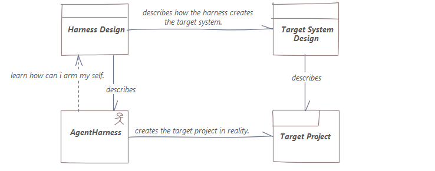

# ArchGraph

An architecture-graph driven framework for Agentic Engineering.

## What is this?

ArchGraph builds a **unified language** that puts harness design and target product design into
**one model** — so you get a single view to work and observe, and real control over your agents.



## Architecture

The global architecture (Layered Viewpoint) shows how the human, the coding agent, ARGO MCP, the
intent architecture graph, ArchiMate 3.2, and Enterprise Architect relate in graph-driven agentic
engineering:


Editable source: [`docs/diagrams/global-architecture.excalidraw`](docs/diagrams/global-architecture.excalidraw)

## Supported Harnesses

ArchGraph deploys the ARGO toolchain to all major coding-agent environments:

| Harness            | MCP Server | Skills | Rules / Instructions | Agents | Wakeup Gate |
|--------------------|:----------:|:------:|:--------------------:|:------:|:-----------:|
| GitHub Copilot     |     ✓      |   ✓    |          ✓           |   ✓    |      —      |
| Cursor             |     ✓      |   ✓    |          ✓           |   ✓    |      —      |
| OpenCode           |     ✓      |   ✓    |          ✓           |   ✓    |     ✓       |
| DeepSeek Harness   |     ✓      |   ✓    |          ✓           |   ✓    |     ✓       |
| OpenClaw           |     ✓      |   ✓    |          ✓           |   —    |     ✓       |

A single `argo-deploy` registers the `argo` MCP server and installs all artifacts into each harness
automatically.

## Install

```powershell
npm install -g archgraph-argo
argo-deploy
```

Done &mdash; the ARGO toolchain, skills, and rules are deployed, and the `argo` MCP server is registered automatically in **GitHub Copilot**, **Cursor**, **OpenCode**, **DeepSeek Harness** (dsh), and **OpenClaw**.

> Semantic (Graph RAG) queries also need **Neo4j** and a **vector engine** configured in
> `~/.argo/.env`; everything else works out of the box.

## How to use

After installing, open your project and start a coding agent. It will:

1. locate the architecture element behind the task before changing anything,
2. arm itself with that element's Skills and Rules,
3. work test-first (GIVEN-WHEN-THEN), and trace every commit back to the graph.

The intent architecture graph — modelled in **ArchiMate 3.2** — is the single source of truth.

## Community

ArchGraph runs on open co-building. Join the community hub to share, browse and reuse **architecture
subgraphs** across projects, and follow the governance & contribution guides:

- **Community site** — https://argo.derekworkspacev5.com/archgraph/ (subgraph library, docs, blog)
- **graph-wiki repository** — https://github.com/derekhu0002/graph-wiki (graph-asset home: contribute
  a subgraph from your project, or pull one back to reuse)

## License

[Apache License 2.0](LICENSE)
