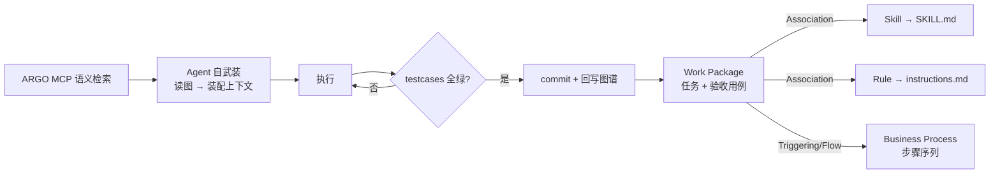
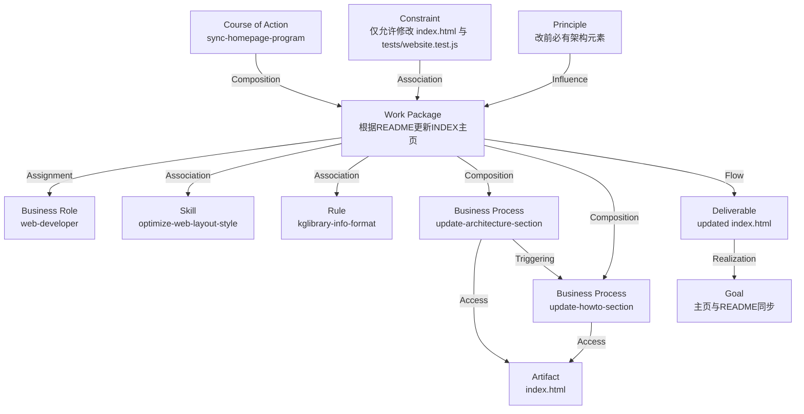

# Agent 编程语言规范（APL）

> 基于知识图谱（ArchiMate 3.2）的 Agent 行为编程词汇与语法。
>
> - 元模型：ArchiMate 3.2
> - 图 Schema：`.argo/schema/SystemArchitecture.schema.json`
> - 规范图：`design/KG/SystemArchitecture.json`
> - 状态：v0.1（草案）

## 1. 概述

### 1.1 目的

本规范定义一套**基于知识图谱的 Agent 编程语言（Agent Programming Language, APL）**，用于描述"一个 Agent 如何完成一个任务"。它把 ArchiMate 3.2 的元素与关系用作编程原语：

- **元素 = 词汇（类型系统）**：用受控的 `archimateElementType` 枚举表达程序中的各类概念（任务、角色、行为、约束、产物等）。
- **关系 = 语法（关键字）**：用受控的 `archimateRelationshipType` 枚举表达这些概念之间的结构、控制流与数据流。
- **testcases = 断言**：挂载在元素上的 GIVEN-WHEN-THEN 可执行验收用例，定义"完成"的判据。

### 1.2 程序文本与解释循环

- **程序文本**：`design/KG/SystemArchitecture.json` 中的元素、关系与视图。
- **解释器**：Agent 通过 ARGO MCP 读取图谱（`getIntentElementContext` / 语义查询），完成"自武装"后执行任务。
- **解释循环**：



### 1.3 设计原则

1. **不改 Schema**：APL 只使用 `SystemArchitecture.schema.json` 中已存在的 `archimateElementType` 与 `archimateRelationshipType` 枚举，通过约定赋予编程语义，不新增字段。
2. **声明式优先**：图谱声明"要什么、用什么做、不许做什么、怎样算完成"，由 Agent 解释执行；命令式细节下沉到 `SKILL.md` 与 `*.instructions.md`。
3. **验收外化**：每个验收用例从元素**外部**验证（外部可观察行为），不验证内部实现。

## 2. 词汇表：元素 → 编程概念

### 2.1 行为层（做什么、怎么做）

| 元素类型 | 编程语义 | 说明 |
|---|---|---|
| `Work Package` | **Task（任务）** | Agent 领取的最小可执行工作单元；挂 `testcases` 作为验收 |
| `Course of Action` | **Program / main（主流程）** | 达成目标的步骤计划，程序入口 |
| `Business Process` | **Procedure（可复用行为定义）** | 步骤序列，可被多个 Task 复用 |
| `Business Function` | **Module（功能模块）** | 行为能力的聚合分组 |
| `Business Interaction` | **Interaction（协作交互）** | 多 Actor 之间的交互行为 |
| `Value Stream` | **Pipeline（端到端流水线）** | 从触发到价值的端到端流程 |

### 2.2 执行者层（谁来执行）

| 元素类型 | 编程语义 | 说明 |
|---|---|---|
| `Business Actor` | **持久化 Agent 本体（人）** | 持久实体：有身份、长期记忆、可反复参与多次执行 |
| `Business Role` | **Role Type（角色类型）** | 可复用角色定义，Actor 通过 `Assignment` 扮演 |
| `Business Collaboration` | **Multi-agent Context（协作上下文）** | 多个 Actor 协作的容器 |
| `Capability` | **Capability（抽象能力）** | Agent 具备的能力，由 `Skill` 实现 |
| `Skill` | **Skill Module（技能模块）** | 物化到 `.github/skills/<name>/SKILL.md` 的可加载技能 |
| `Stakeholder` | **Stakeholder（利益相关者）** | 结果的干系人 |

### 2.3 事件/控制层（何时、按什么顺序）

| 元素类型 | 编程语义 | 说明 |
|---|---|---|
| `Business Event` | **Event（事件/触发条件）** | 程序入口的触发 |
| `Implementation Event` | **Milestone / Checkpoint（里程碑）** | 检查点、阶段闸门 |
| `And Junction` | **并行/汇聚（AND fork/join）** | 并发执行 |
| `Or Junction` | **分支/汇聚（OR branch/merge）** | 条件选择 |

### 2.4 服务/接口层（对外契约）

| 元素类型 | 编程语义 | 说明 |
|---|---|---|
| `Business Service` | **Service / API（服务契约）** | 对外可调用的行为 |
| `Business Interface` | **Interface（接口）** | 边界与接入点 |
| `Application Service` | **App Service** | 应用层服务 |
| `Contract` | **Contract（契约）** | 协作双方的协议 |

### 2.5 结构/数据层（操作什么、产出什么）

| 元素类型 | 编程语义 | 说明 |
|---|---|---|
| `Business Object` | **Object / State（状态对象）** | 被读写的对象 |
| `Data Object` | **Data（数据）** | 数据 |
| `Artifact` | **File / Artifact（制品）** | 仓库里的实际文件 |
| `Deliverable` | **Output / Return Value（产物）** | 任务的输出 |
| `Resource` | **Dependency（依赖资源）** | 执行所需的资源 |
| `Representation` | **Representation（表示）** | 数据的呈现形式 |
| `Meaning` / `Value` | **Semantics / Value** | 语义与价值 |

### 2.6 意图/约束层（为什么做、不能做什么）

| 元素类型 | 编程语义 | 说明 |
|---|---|---|
| `Goal` | **Goal（目标）** | 要达成的目标 |
| `Outcome` | **Assertion（期望结果）** | 可被 `testcase` 验证的结果 |
| `Driver` | **Motivation（动机）** | 为什么要做 |
| `Requirement` | **Precondition（前置需求）** | 必须满足的条件 |
| `Principle` | **Global Constraint（全局约束）** | 始终适用，物化到全局 `*.instructions.md` |
| `Constraint` | **Local Constraint（局部约束）** | 只作用于关联的 Task / Process |
| `Rule` | **Rule Module（规则模块）** | 物化到 `.github/<name>.instructions.md` 的可复用规则 |
| `Assessment` | **Evaluation / Check（评审）** | 检查/评审动作 |

约束的三级区分：

- `Principle`（全局）：对所有任务始终适用，例如"修改前必须先找到架构元素"。
- `Rule`（规则模块）：可复用的规则，物化为 `.github/*.instructions.md`。
- `Constraint`（局部）：只约束它 `Association` 到的某个 Task / Process。

### 2.7 组织/环境层

| 元素类型 | 编程语义 | 说明 |
|---|---|---|
| `Grouping` | **Namespace（命名空间/模块）** | 组织单元，如 Viewpoint |
| `Plateau` | **Stage / State（阶段状态）** | 状态快照 |
| `Gap` | **TODO / Diff（缺口）** | 现状与目标的差异 |
| `Product` | **Product（最终产品）** | 交付的最终产品 |
| `Node` / `Device` / `System Software` | **Runtime / Environment（运行时环境）** | 执行环境 |

## 3. 语法：关系 → 语法语义

关系类型是 APL 的关键字：

| 关系类型 | 语法语义 | 典型用法 |
|---|---|---|
| `Association` | **use（引用/依赖）** | `Task → Skill`、`Task → Rule`、`Task → Resource` |
| `Assignment` | **assign（指派）** | `Task → Role`、`Task → Actor` |
| `Realization` | **implements（实现）** | `Process → Service`、`Skill → Capability`、`Deliverable → Goal` |
| `Serving` | **serves（服务）** | `Service → Actor` |
| `Access` | **read/write（读写）** | `Process → Data Object` |
| `Triggering` | **then / triggers（顺序/触发）** | `Event → Task`、`Task → Task` |
| `Flow` | **pipe（数据流转）** | `Task → Deliverable`、`Task → Artifact` |
| `Composition` | **contains（强组合）** | `Course of Action → Task`、`Task → Sub-task` |
| `Aggregation` | **aggregates（松聚合）** | `Task → 关联资源集` |
| `Influence` | **influences（影响）** | `Driver → Goal`、`Assessment → Decision` |
| `Specialization` | **extends（特化/继承）** | `Role → 更具体的 Role` |

## 4. 验收断言：testcases

`testcases` 是 APL 的**单元测试/断言**，挂载在元素上，必须满足：

1. **GIVEN-WHEN-THEN 格式**：`description` 用 GIVEN-WHEN-THEN 描述规格，便于人读。
2. **可执行**：`acceptanceCriteria` 必须是具体的、工作区相对的可执行入口（如 `node --test tests/xxx.test.js`），而非描述性文字。
3. **外部验证**：从元素外部可观察行为验证，不验证内部实现。

示例：

```jsonc
{
  "name": "AT-1333-01-编程语言规范文档",
  "description": "GIVEN 仓库已建立基于知识图谱的记忆系统；WHEN 读者打开 docs/agent-programming-language.md；THEN 文档定义词汇表、语法、验收断言与持久化/运行时边界。",
  "type": "Acceptance Test",
  "Input": "打开 docs/agent-programming-language.md",
  "acceptanceCriteria": "执行 node --test tests/agent-programming-language.test.js：断言文档存在并包含词汇表、语法、testcases、持久化/运行时等关键章节。通过。"
}
```

## 5. 持久化元素 vs 运行时实例

ArchiMate 是**设计时语言**，建模"类型/定义"，不建模运行时实例。APL 严格区分：

| 类别 | 是否进图谱 | 例子 |
|---|---|---|
| **持久化元素**（程序文本） | 是，长期存在 | `Business Actor`、`Business Role`、`Capability`、`Skill`、`Rule`、`Work Package`、`Business Process`、`Course of Action`、`Goal`、`Constraint`、`Principle` |
| **运行时实例**（程序运行） | 否，只回写结果 | 一次 session、一次执行、一份 commit |

- `Business Actor` 是**持久化的人**：有身份、长期记忆（记忆即知识图谱本身），可反复参与多次执行。
- 一次"agent session"是运行时实例：由 `Work Package` 通过 `Assignment` 指派给某个持久 `Business Actor` 执行；执行结果通过 `attributes` 中的 `commit` 回写，不新建元素。

## 6. 完整程序示例

以"根据 README 更新 INDEX 主页"（Work Package `1332`）为例：



## 7. 与 Schema 的一致性

本规范不修改 `SystemArchitecture.schema.json`。所有元素类型均来自 `archimateElementType` 枚举，所有关系类型均来自 `archimateRelationshipType` 枚举。新增能力通过**约定**而非 schema 扩展实现；若未来需要新的原语，应先评估是否可映射到现有枚举，再考虑扩展 schema。
