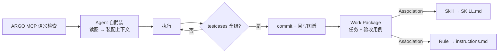
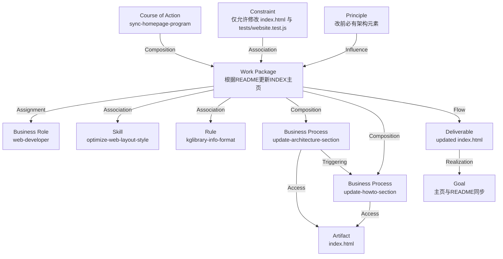

# Agent 建模语言（AML）

> 基于知识图谱的 Agent 行为建模语言。AML 是 ArchiMate 3.2 的**扩展**：扩展其词汇（新增元素）与语法（新增结构约定），并约定如何用标准元素给 Agent 建模。
>
> - 元模型：ArchiMate 3.2（AML 为其扩展）
> - 图 Schema：`.argo/schema/SystemArchitecture.schema.json`
> - 状态：v0.1（草案）

## 1. 定位与扩展范围

AML 不改动 ArchiMate 3.2 已有的元素与关系定义，只在以下层面扩展：

| 扩展层面 | 内容 | 是否标准 ArchiMate 3.2 |
|---|---|---|
| 新增元素类型 | `Skill`、`Rule` | 否，AML 扩展（`layer: Other`、`aspect: Agent`） |
| 新增结构约定 | `testcases`、`attributes`、`subdiagram_views`、`parent` | 否，AML 扩展 |
| 标准元素的 AML 约定（Profile） | 对 `Work Package`、`Business Actor` 等赋予 Agent 语义 | 元素本身标准，语义约定为 AML 新增 |

> 本文只描述**扩展部分**。ArchiMate 3.2 已有元素与关系的定义，请参阅 `.argo/schema/archimate3.2.pdf`。

### 1.1 解释循环

- **程序文本**：`design/KG/SystemArchitecture.json` 中的元素、关系与视图。
- **解释器**：Agent 通过 ARGO MCP 读取图谱（`getIntentElementContext` / 语义查询），完成"自武装"后执行任务。



## 2. 扩展元素

### 2.1 `Skill`（技能模块）

- **语义**：Agent 可加载的技能模块。
- **物化**：`.github/skills/<name>/SKILL.md`（一个 `Skill` 元素对应一份 SKILL.md）。
- **用法**：`Work Package --Association--> Skill` 表示该任务需要该技能；Agent 领取任务后读取对应 SKILL.md 完成"自武装"。
- **示例**：元素 `1319 optimize-web-layout-style` → `.github/skills/optimize-web-layout-style/SKILL.md`。

### 2.2 `Rule`（规则模块）

- **语义**：可复用的规则模块。
- **物化**：`.github/<name>.instructions.md`（一个 `Rule` 元素对应一份 instructions 文件）。
- **用法**：`Work Package --Association--> Rule` 表示该任务需遵守该规则；全局规则物化到 `.github/copilot-instructions.md`。
- **示例**：元素 `1320 kglibrary-info-format` → `.github/kglibrary.instructions.md`。

### 2.3 `Skill` / `Rule` 与标准元素的区分

| 概念 | 标准/扩展 | 物化目标 |
|---|---|---|
| `Capability`（标准） | 抽象能力，不直接物化 | — |
| `Skill`（扩展） | 可加载技能模块 | `.github/skills/<name>/SKILL.md` |
| `Principle`（标准） | 全局约束 | 全局 `*.instructions.md` |
| `Rule`（扩展） | 可复用规则模块 | `.github/<name>.instructions.md` |
| `Constraint`（标准） | 局部约束 | —（挂在关联的 Task/Process 上） |

约束的三级区分：

- `Principle`（全局）：对所有任务始终适用，例如"修改前必须先找到架构元素"。
- `Rule`（规则模块）：可复用的规则，物化为 `.github/*.instructions.md`。
- `Constraint`（局部）：只约束它 `Association` 到的某个 Task / Process。

## 3. 扩展结构

### 3.1 `testcases`（验收断言）

`testcases` 是 AML 的**断言机制**，挂载在元素上，标准 ArchiMate 没有对应概念。每个用例必须：

1. **GIVEN-WHEN-THEN 格式**：`description` 用 GIVEN-WHEN-THEN 描述规格。
2. **可执行**：`acceptanceCriteria` 必须是工作区相对的可执行入口（如 `node --test tests/xxx.test.js`）。
3. **外部验证**：从元素外部可观察行为验证，不验证内部实现。

示例：

```jsonc
{
  "name": "AT-1333-01-编程语言规范文档",
  "description": "GIVEN 仓库已建立基于知识图谱的记忆系统；WHEN 读者打开 docs/agent-programming-language.md；THEN 文档定义词汇表、语法、验收断言与持久化/运行时边界。",
  "type": "Acceptance Test",
  "Input": "打开 docs/agent-programming-language.md",
  "acceptanceCriteria": "执行 node --test tests/agent-programming-language.test.js：断言文档存在并包含词汇表、语法、testcases、持久化/运行时等关键章节。通过。"
}
```

### 3.2 `attributes`（属性容器）

通用属性容器，用于给元素附加 Agent 工程元数据。AML 约定的属性名：

| 属性名 | 用途 |
|---|---|
| `commit` | 登记一次提交：`value`=commit id，`description`=相关文件路径（可多条） |
| `status` | 任务状态（如 `COMPLETED`） |
| `verification_focus` / `external_scope` / `acceptance_outcomes` / `design_risks` | 架构意图元数据（schema 建议） |

### 3.3 `subdiagram_views` / `parent`（结构挂载）

- `parent`：元素在视图树中的父元素（如 Work Package 挂在 Viewpoint `Grouping` 下）。
- `subdiagram_views`：元素与子图 View 的关联。

## 4. 标准元素的 AML 约定（Profile）

对标准 ArchiMate 元素，AML 只约定 Agent 语义，元素定义见 ArchiMate 3.2。

| 标准元素 | AML 约定语义 |
|---|---|
| `Work Package` | Task（任务）：Agent 领取的最小工作单元 |
| `Course of Action` | Program / main（主流程） |
| `Business Process` | Procedure（可复用行为定义） |
| `Business Actor` | 持久化 Agent 本体 |
| `Business Role` | Role Type（角色类型） |
| `Business Collaboration` | Multi-agent Context（协作上下文） |
| `Capability` | 抽象能力 |
| `Business Event` | Event（事件/触发条件） |
| `Implementation Event` | Milestone（里程碑/检查点） |
| `And Junction` / `Or Junction` | 控制流分支与汇聚 |
| `Business Service` / `Business Interface` | Service / Interface（服务/接口契约） |
| `Business Object` / `Data Object` | Object / Data（状态对象/数据） |
| `Artifact` | File（仓库文件） |
| `Deliverable` | Output（产物/返回值） |
| `Goal` / `Outcome` | Goal / Assertion（目标/期望结果） |
| `Driver` / `Requirement` / `Assessment` | Motivation / Precondition / Check |
| `Principle` / `Constraint` | Global / Local Constraint |
| `Plateau` / `Gap` | Stage / TODO（阶段状态/缺口） |
| `Grouping` | Namespace（命名空间） |

### 4.1 关系（关键字）的 AML 用法

关系类型均为标准 ArchiMate 关系，AML 只约定用法：

| 关系类型 | AML 用法 |
|---|---|
| `Association` | use（引用 Skill/Rule/Resource） |
| `Assignment` | assign（Task → Role/Actor） |
| `Realization` | implements（Process→Service、Skill→Capability、Deliverable→Goal） |
| `Serving` | serves（Service → Actor） |
| `Access` | read/write（Process → Data Object） |
| `Triggering` | then（顺序/触发） |
| `Flow` | pipe（数据流转） |
| `Composition` | contains（主流程→Task） |
| `Aggregation` | aggregates |
| `Influence` | influences |
| `Specialization` | extends |

## 5. 持久化元素 vs 运行时实例

ArchiMate 是**设计时语言**，建模"类型/定义"，不建模运行时实例。AML 遵循同一边界：

| 类别 | 是否进图谱 | 例子 |
|---|---|---|
| **持久化元素**（程序文本） | 是，长期存在 | `Skill`、`Rule`、`Business Actor`、`Business Role`、`Capability`、`Work Package`、`Business Process`、`Course of Action`、`Goal`、`Constraint`、`Principle` |
| **运行时实例**（程序运行） | 否，只回写结果 | 一次 session、一次执行、一份 commit |

- `Business Actor` 是**持久化的人**：有身份、长期记忆（记忆即知识图谱本身），可反复参与多次执行。
- 一次"agent session"是运行时实例：由 `Work Package --Assignment--> Business Actor` 的一次执行表达；结果通过 `attributes.commit` 回写，不新建元素。

## 6. 完整程序示例

以"根据 README 更新 INDEX 主页"（Work Package `1332`）为例：



## 7. 合规与扩展流程

- `Skill` / `Rule` 是 `archimateElementType` 枚举中仅有的两个非标准元素，已登记于 `.argo/scripts/archimate32-rules.js`（`layer: "Other"`、`aspect: "Agent"`）。
- 本规范不修改 `SystemArchitecture.schema.json`。
- 未来需要新原语时，依次评估：① 能否映射到标准 ArchiMate 元素（加约定）；② 能否用 `attributes` 表达；③ 仍不能才扩展 `archimateElementType` 枚举。
