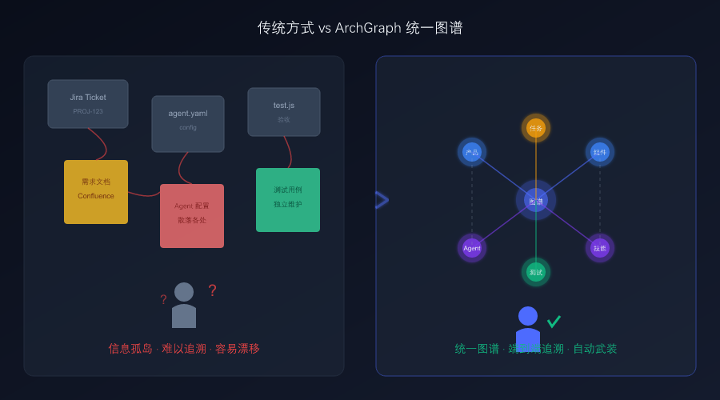
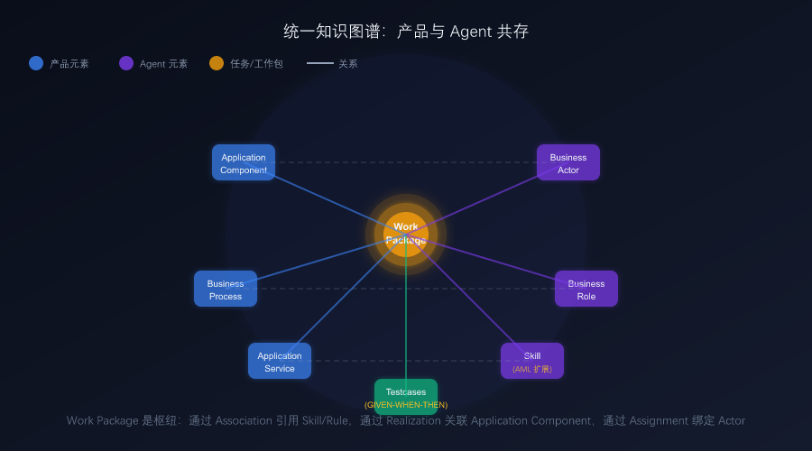
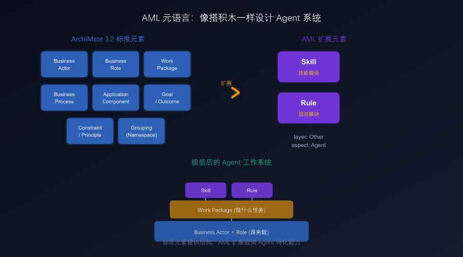
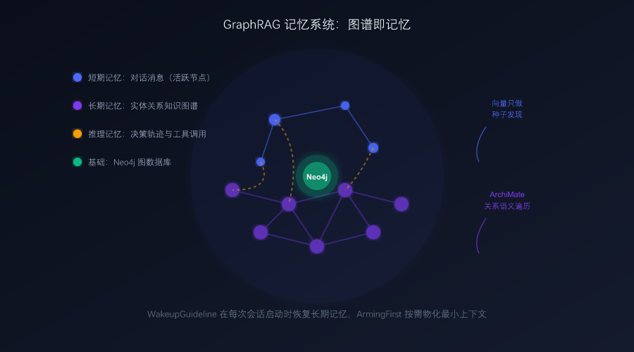

# 设计 Agent 工作系统：用一张图谱，同时设计工人和房子

Agent 能写代码了，能调研了，能帮你发公众号了。但当你真正想把 Agent 工程化交付时，会发现一个根本性问题：

**你能设计产品，但你能设计"做产品的 Agent 系统"吗？**

大多数团队的做法是：用 Jira 管需求，用 YAML 配 Agent，用 Markdown 写 Skill，用代码写测试。这些东西散落在不同地方，彼此之间没有机器可读的关联。改了一个忘改另一个，Agent 行为漂移了也不知道。

ArchGraph 的解法很直接：**提供一种更高的统一抽象设计层，让你用同一张图谱，同时设计"工人"（Agent 工作系统）和"房子"（目标产品）。**

这篇文章讲清楚三件事：统一抽象层是什么、元语言怎么设计 Agent 系统、GraphRAG 记忆系统怎么让 Agent 跨会话保持连贯。

---

## 一、传统方式 vs 统一图谱



左边是大多数团队的现状：需求文档在 Confluence，Agent 配置在 YAML 文件，测试用例在代码仓库，Skill 描述在 Markdown。它们之间只有人脑里的关联，没有机器可理解的连接。Agent 领到一个任务，不知道该用什么 Skill、遵守什么 Rule、交付什么产物——全靠 prompt 里硬编码。

右边是 ArchGraph 的方式：所有东西都在同一张知识图谱里。产品组件（Application Component）、Agent 本体（Business Actor）、角色（Business Role）、任务（Work Package）、技能（Skill）、规则（Rule）、验收用例（Testcases）——全部是图谱中的节点，通过标准关系连接。

**关键差异**：传统方式中，Agent 的"工作系统"是隐式的、散落的、不可观察的；ArchGraph 中，Agent 的工作系统是显式的、结构化的、可导航的。

---

## 二、统一抽象设计层：工人和房子在同一张图纸上



这张图展示了 ArchGraph 的核心创新：**Work Package（工作包）是枢纽**。

左侧蓝色节点是产品元素：Application Component（产品组件）、Business Process（业务流程）、Application Service（应用服务）。这些描述"房子长什么样"。

右侧紫色节点是 Agent 元素：Business Actor（Agent 本体）、Business Role（角色类型）、Skill（技能模块）。这些描述"工人是谁、会什么技能"。

中间的金色 Work Package 把两者连起来：
- 通过 **Association** 关系引用 Skill 和 Rule（工人需要什么技能）
- 通过 **Realization** 关系关联 Application Component（任务交付什么产品）
- 通过 **Assignment** 关系绑定 Business Actor（谁来做这个任务）
- 通过 **testcases** 挂载验收用例（怎么算做对了）

**一个具体例子**：Work Package "优化 WEB 布局和风格"同时关联了：
- 产品组件：`index.html`（改什么）
- 技能：`optimize-web-layout-style` SKILL.md（怎么改）
- 规则：`kglibrary-info-format` instructions.md（遵守什么约束）
- 验收用例：AT-1317-01、AT-1317-02（怎么验证）
- 15 条 commit 记录（变更历史）

Agent 领取这个任务后，沿图谱关系自动"自武装"——读取关联的 Skill 和 Rule，获得完成工作所需的全部知识，不需要 prompt 里硬编码。

**这就是统一抽象层的价值**：人类设计的是"工人和房子的关系"，Agent 执行时自动理解上下文。

---

## 三、AML 元语言：像搭积木一样设计 Agent 系统



ArchGraph 没有重新发明一套 DSL，而是把 TOGAF 标准的企业架构语言 **ArchiMate 3.2** 扩展为 Agent 建模语言（AML）。

为什么选 ArchiMate？因为它本身有 60 多个标准元素，能覆盖 90% 的 Agent 概念：
- `Business Actor` → 持久化 Agent 本体（有身份、有长期记忆）
- `Business Role` → 角色类型（Developer、Reviewer、产品经理...）
- `Work Package` → 任务（Agent 领取的最小工作单元）
- `Business Process` → 可复用行为定义
- `Goal` / `Constraint` / `Principle` → 目标与约束

AML 只扩展了 **2 个新元素**：
- **Skill**（技能模块）：物化为 `.github/skills/<name>/SKILL.md`
- **Rule**（规则模块）：物化为 `.github/<name>.instructions.md`

这两个是 Agent 特有的，标准 ArchiMate 里确实没有。它们被登记为 `layer: "Other", aspect: "Agent"`，明确声明是 AML 扩展。

**形式化约束**靠的是 1200 多行的关系推导规则（`RELATIONSHIP_TARGET_MATRIX`）。它定义了哪些元素之间可以建立什么类型的关系，防止语义上的非法连接。比如，你不能把一个 Skill 直接 Assignment 给一个 Application Component——这种错误在 YAML 里只有运行时才能发现，在 ArchiMate 里建模阶段就会被拦住。

**扩展控制**用三步评估法： 能否映射到标准元素？② 能否用 attributes 表达？③ 仍不能才扩展枚举。至今只新增了 2 个元素类型，证明 ArchiMate 作为基座的表达力足够强大。

---

## 四、GraphRAG 记忆系统：图谱即记忆



Agent 的长期记忆不是独立的向量数据库，而是**图谱本身的 Sub-View 层级结构**。

每个 `Business Actor` 的长期记忆被建模为挂载在该 Actor 下的子视图层级（`parent_element_id` 指向该 Actor 的 View）。这不是"包含该 Actor 的 View"，而是"以该 Actor 为父节点的 View 及其递归嵌套的子 View"。

**WakeupGuideline** 在每次会话启动时恢复记忆：
1. 调用 ARGO MCP 查询所有 Business Actor，确认"我是谁"
2. 读取该 Actor 下的子视图层级，恢复长期记忆
3. 校验 `agent` 属性与当前 Agent 类型是否匹配

**GraphRAG 查询管线**不是简单的向量相似度搜索，而是五阶段管线：
1. **W2**：嵌入向量生成（Qwen 1024 维）
2. **W3**：变更驱动增量索引（图谱变更时自动更新向量）
3. **W4**：三通道种子检索（Element ≥ 0.8、Relationship ≥ 0.78、View ≥ 0.76）
4. **W5**：目的策略闭包（ArchiMate 语义遍历，非自由 Cypher）
5. **W6**：结构化补全（端点/视图/溯源）

**关键区别**：向量只做种子发现（W4），真正的上下文组装依赖 ArchiMate 关系方向语义（W5）。这意味着 Agent 获得的不是"相似的内容片段"，而是"结构化的依赖上下文"。

**ArmingFirst 原则**确保最小上下文组装：Agent 只物化当前 Work Package 需要的 Skills 和 Rules，不会一次性加载整个图谱。

---

## 五、人对 Agent 的掌控力

统一抽象层带来的最大价值是**人对 Agent 工作系统的掌控力**。

### 5.1 可观察

人类通过 Viewpoint 分层观察图谱：
- **Implementation and Migration Viewpoint**：看任务进度、技能武装、交付状态
- **Application Cooperation Viewpoint**：看产品组件如何协作、谁在使用什么服务
- **Harness Viewpoint**：看 Agent 组织、角色分工、协作流程

同一张图谱，不同视角。人类可以从宏观到微观下钻，Agent 通过语义查询按需探索。

### 5.2 可约束

Agent 的每一步操作都受图谱约束：
- **CoreRules 6 条红线**：改前必找元素、走 MCP、测试先行、提交登记、记忆回写、持续合规
- **CoperationGuideline**：Agent 不能越权，必须通过正式委派流程协作
- **AcceptanceTestFirst**：修改前必须识别受影响的验收用例，改后跑回归

这些不是建议，是强制规则。Agent 的 system prompt 里写死了，违反任何一条都会触发纠偏。

### 5.3 可纠偏

当 Agent 偏离时，人类不需要重新写 prompt，而是**修改图谱**：
- 修改 Role 的 description → 改变 Agent 的职责边界
- 修改 Work Package 的 testcases → 改变验收标准
- 修改 Skill/Rule 的物化文件 → 改变 Agent 的武装内容
- 修改 Assignment 关系 → 重新分配任务

图谱是人和 Agent 的**共同操作界面**。人类修改图谱，Agent 下次启动时自动感知。

---

## 六、总结

ArchGraph 的核心创新是**提供了一种更高的统一抽象设计层**：

1. **用 ArchiMate 3.2 元语言设计 Agent 工作系统**——不是 YAML 配置，不是 Python 代码，而是标准化、可视化、可推理的架构图
2. **把 Agent 设计和产品设计放在同一张图谱**——Work Package 是枢纽，连接工人（Actor/Role/Skill）和房子（Component/Process/Service）
3. **用 GraphRAG 构建先进记忆系统**——图谱即记忆，向量只做种子发现，真正的上下文组装靠 ArchiMate 关系语义
4. **让人类保持掌控力**——可观察（Viewpoint 分层）、可约束（CoreRules 红线）、可纠偏（修改图谱即修改 Agent 行为）

**Agent 缺的不是更聪明的脑子，而是一张施工图。** ArchGraph 给的正是这张图——工人和房子在同一张图纸上，人类设计系统，Agent 执行系统。

---

**快速开始**

```powershell
npm install -g archgraph-argo
argo-deploy
```

一条命令部署到 GitHub Copilot、Cursor、OpenCode、DeepSeek Harness。

开源地址：[github.com/derekhu0002/archgraph](https://github.com/derekhu0002/archgraph)
官网：[archgraph.org](https://archgraph.org)
