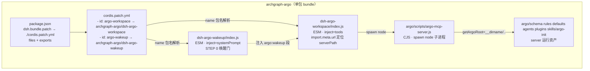

# 发布 ArchGraph 为 DSH 插件（dsh-plugin）— 方案设计

> 工作包：发布 ArchGraph 为 DSH 插件 (dsh-plugin)（2767）
> 角色：系统设计师（caoyang，Business Actor 2739 / Business Role 系统设计师 2738）
> 交付对象：规划专家 / 系统架构师（评审）→ 开发者（实现）
> 输入：`docs/dsh-plugin-publish.md`（US-1–4、AC-1–7）、`package.json`（archgraph-argo）
> 参考：`deepseek-harness/docs/user/develop/basic/{index,config,publish}.md`、既有 `install-argo.ps1` 的 DSH 部署路径

## 0. 现状与目标

- **现状**：DSH 集成由 `install-argo.ps1` 生成两个 Cordis 插件部署工件到 `~/.dsh/plugins/`（`dsh-argo-workspace/index.js` 直连 argo MCP、`dsh-argo-wakeup/index.js` 注册唤醒门），并以 `file://` 行写入 `~/.dsh/cordis.patch.yml` 的受管块。该形态**只能本机部署，无法被 `dsh plugin add` 安装/分发**（不是 `dsh.bundle`）。
- **目标**：把这两个插件封装为可 `dsh plugin --profile <name> add github:derekhu0002/archgraph` 安装的 **bundle**（`package.json` 的 `dsh.bundle` + 根 `cordis.patch.yml` + 包内入口模块），纯 JS 零构建，不触碰 `install-argo.ps1` / `argo-deploy` 既有部署路径（无回归）。

## 1. 总体结构

bundle = 现有单包 `archgraph-argo`（不拆包）。目录形态（新增部分以 `+` 标记，其余为既有 `files` 已覆盖的资产）：

```
archgraph-argo/                          # 单包（name = archgraph-argo）
├── package.json          +dsh.bundle / +exports / +files 增补
├── cordis.patch.yml      + 根 patch：两行以包名插入 argo-workspace / argo-wakeup
├── dsh-argo-workspace/
│   ├── package.json      + {"type":"module"}（目录级 ESM 标记，非独立包）
│   └── index.js          + ESM 插件：直连 argo MCP stdio，注册 mcp__argo__*
├── dsh-argo-wakeup/
│   ├── package.json      + {"type":"module"}
│   └── index.js          + ESM 插件：注入 STEP 0 唤醒门 system prompt
├── argo/
│   ├── scripts/argo-mcp-server.js   既有（CJS，被 spawn 为子进程）
│   ├── schema/ rules/ defaults/ agents/ plugins/ skills/argo-init  既有资产
│   └── package.json                  既有（argo/ 目录仍为 CJS）
├── bin/ install-argo.ps1/ vendor/    既有（CLI/部署器，保持不变）
```



数据流（安装与运行）：

1. **安装**：`dsh plugin --profile <name> add github:derekhu0002/archgraph` → pnpm 把 `archgraph-argo` 装进 profile 的 node_modules（git 源码直装，纯 JS 无需 `prepare`）→ dsh 读 `dsh.bundle.patch=./cordis.patch.yml` 并把 `archgraph-argo` 追加进 `dsh.profile.bundles`。
2. **配置合成**：加载 profile 时，按 `dsh.profile.bundles` 顺序应用 `cordis.patch.yml` 层；两行以**包名**（非 `file://`）引用插件，Node/DSH 加载器按 `exports` 子路径解析到包内 `index.js`。
3. **运行**：`dsh-argo-workspace` 用 `import.meta.url` 相对定位包内 `argo/scripts/argo-mcp-server.js`（默认值，`config.serverPath` 仅作覆盖）→ spawn `node <server>` 建最小 MCP stdio 客户端 → 注册每个 argo 工具为 `mcp__argo__*` → 每次调用注入当前会话 `workspaceRoot`（`exec.agent.session.header?.cwd`）。`dsh-argo-wakeup` 把 STEP 0 无条件唤醒门注册为 system prompt 首段。

## 2. 关键设计决策（AD-a..AD-e）

### AD-a：bundle 形态 —— 加到现有单包 `archgraph-argo`（不拆包）

- **决策**：把 `dsh` 键（`dsh.bundle.patch`）加到现有单包 `archgraph-argo`；同时增补 `files`（`cordis.patch.yml` + 两个入口模块目录）与 `exports`（两个插件子路径 + manifest 透出）。
- **理由**：单一包名即单一安装命令 `dsh plugin add github:derekhu0002/archgraph`（`dsh plugin add` 每次只装一个包，GitHub 单仓库天然对应单包）；`files` 已含 `argo/scripts`、`argo/schema`、`argo/rules`、`argo/defaults`、`argo/agents`、`argo/plugins`、`argo/skills/argo-init` 等运行资产，`dsh-argo-workspace` 只需把 server 定位到包内即可复用，无需搬运资产。`name` 同时是 bundle 在 `dsh.profile.bundles` 中的身份（显示 `archgraph-argo`）。
- **被否方案**：拆出独立 `dsh-argo-plugin` 包 —— 需要双包/双发布与版本同步，且 `dsh plugin add github:...` 无法一次装两个包，增加用户认知与维护成本。

`package.json` 关键片段（相对现有内容，新增三处）：

```jsonc
{
  "name": "archgraph-argo",
  "files": [
    "argo/scripts",
    "argo/schema",
    "argo/defaults",
    "argo/agents",
    "argo/plugins",
    "argo/skills/argo-init",
    "argo/rules",
    "argo/package.json",
    "vendor",
    "install-argo.ps1",
    "bin",
    "cordis.patch.yml",
    "dsh-argo-workspace",
    "dsh-argo-wakeup"
  ],
  "exports": {
    "./dsh-argo-workspace": "./dsh-argo-workspace/index.js",
    "./dsh-argo-wakeup": "./dsh-argo-wakeup/index.js",
    "./cordis.patch.yml": "./cordis.patch.yml",
    "./package.json": "./package.json"
  },
  "dsh": {
    "bundle": { "patch": "./cordis.patch.yml" }
  }
}
```

> 说明：`exports` 只透出两个插件子路径与两个 manifest，**不映射 `"."`**（本包无根入口模块，仅作 CLI/部署器 + bundle 消费，为不存在的根模块伪造入口反而误导）；若未来需要 `import 'archgraph-argo'` 再补 `"."` 映射。`./cordis.patch.yml` / `./package.json` 的透出对齐 in-box bundle `@deepseek-ai/dsh-web-app` 的做法。

### AD-b：`cordis.patch.yml` 两行（包名）＋ `serverPath` 以 `import.meta.url` 相对定位

- **决策**：根 `cordis.patch.yml` 以**包名**（非 `file://`）插入两行——`argo-workspace` 行 `name: archgraph-argo/dsh-argo-workspace`、`argo-wakeup` 行 `name: archgraph-argo/dsh-argo-wakeup`；`argo-workspace` 行**不在 patch 里写死 `config.serverPath`**，改由插件 `apply()` 内以 `import.meta.url` 相对定位包内 `../argo/scripts/argo-mcp-server.js` 作为默认值，`config.serverPath`（或 `ARGO_SERVER_PATH`）仅作覆盖。
- **理由**：
  1. `name` 用包名让 Node/DSH 解析到「安装后」的包内代码，满足 publish.md「plugin rows reference the package by name」；`file://` 绝对路径只能本机有效，无法分发。
  2. `serverPath` 写死绝对路径不可跨机器移植（`install-argo.ps1` 现在写的是 `~/.argo/scripts/...` 本机绝对路径）；`import.meta.url` 相对定位使 server **随包走**，在 node_modules、tarball、pnpm link 三种安装形态下均成立，用户零配置即可用。
  3. `argo/scripts/argo-paths.js` 的 `getArgoRoot()` 以 `__dirname`（=`<pkg>/argo/scripts`）解析安装资产（schema/rules/defaults 等），server 从包内启动即**自包含**，与全局 `~/.argo` 布局无关。
  4. `config.serverPath` 仅作覆盖，符合 config.md「可调值做成配置项、缺省可留」原则，也允许高级用户指向自建的 `~/.argo/scripts/argo-mcp-server.js`。
- **回退链**（运行时按优先级）：`config.serverPath` → `process.env.ARGO_SERVER_PATH` → `import.meta.url` 相对定位的包内默认值；三者都不可用（定位失败）时 `console.warn` 告警并跳过工具注册（与现有 `dsh-argo-workspace` 的失败行为一致，不挂起会话）。
- **被否方案**：patch 里写死 `config.serverPath: '<包内绝对路径>'`（不可移植）；继续 `file://` 行（无法 `dsh plugin add` 分发，非 bundle）。

`cordis.patch.yml`（根，新文件）关键片段：

```yaml
# ArchGraph ARGO bundle patch：随 bundle 安装，按包名引用包内插件（非 file://）。
- insert:
    - id: argo-workspace
      name: archgraph-argo/dsh-argo-workspace
    - id: argo-wakeup
      name: archgraph-argo/dsh-argo-wakeup
```

`dsh-argo-workspace/index.js` 的 `serverPath` 定位片段：

```js
import { fileURLToPath } from 'node:url'

// 包内默认：<pkg>/argo/scripts/argo-mcp-server.js —— 随包走，跨机器可移植。
const DEFAULT_SERVER_PATH = fileURLToPath(
  new URL('../argo/scripts/argo-mcp-server.js', import.meta.url),
)

export async function apply(ctx, config) {
  const serverPath = config.serverPath
    ?? process.env.ARGO_SERVER_PATH
    ?? DEFAULT_SERVER_PATH
  // 其余与现有 generated 插件一致：spawn('node', [serverPath]) 建最小 MCP stdio 客户端，
  // 注册每个工具为 mcp__argo__*，execute 时注入 exec.agent.session.header?.cwd 作为 workspaceRoot。
}
```

### AD-c：两个入口模块放仓库根（与验收契约一致），ESM 形态用目录级 `package.json` 标记

- **决策**：入口模块放仓库根 `dsh-argo-workspace/index.js`、`dsh-argo-wakeup/index.js`（与验收契约 `bundle-entry` 断言的路径一致），由 `exports` 暴露 `./dsh-argo-workspace`、`./dsh-argo-wakeup` 子路径。两模块为 **ESM**（`export const name` / `export function apply`，与现有 `file://` 部署工件同形）；为保证在 Node 原生解析下语义无歧义，各目录放一个**目录级 `package.json`（`{"type":"module"}`）**标记 ESM，而不改根包的模块形态。
- **理由**：
  1. 仓库根路径是验收契约的硬约束（`tests/dsh-plugin-publish.test.js` 的 `bundle-entry` 断言 `path.join(ROOT, 'dsh-argo-workspace', 'index.js')` 存在且导出 `apply`）。
  2. 根 `package.json` 不加 `"type":"module"`——根下 `bin/argo-deploy.js` 与 `argo/scripts/*.js` 是 CommonJS（`require`），根级 `"type":"module"` 会破坏它们（`argo/` 子树因有 `argo/package.json` 可豁免，但根级 `bin/` 会中招）。目录级 `package.json` 只把 ESM 作用域限定在 `dsh-argo-*` 两目录，零侵入、非破坏。
  3. `exports` 子路径是 ESM 下 `import('archgraph-argo/dsh-argo-workspace')` 解析的前提（无 `exports` 时 Node ESM 拒绝包内子路径导入）。
- **被否方案**：入口放 `argo/plugins/` 或 `src/`（与验收契约路径冲突）；合并为根单文件 `index.js`（两个插件需要独立的 `inject`/生命周期与 Cordis 行隔离，单文件不利于按 `id` 覆盖）；根级 `"type":"module"`（破坏既有 CJS CLI/脚本，违背无回归）。

### AD-d：纯 JS 无构建 → 无需 `prepare`，git 安装直接可用

- **决策**：**不提供 `prepare` 脚本**。两个入口模块与 `argo/scripts` 全部为纯 JS（ESM/CJS 原样，无 TS、无 `lib/` 产物），`dsh plugin --profile <name> add github:derekhu0002/archgraph` 取源码即可加载，无需构建、也无需用户在 profile 的 `pnpm-workspace.yaml` 里 `allowBuilds` 授权。
- **理由**：publish.md「build-script catch」只约束「需要构建（TS→lib）才要 `prepare`」的包；本仓库零构建，git 安装拿到即用，且免去 pnpm ≥10 的 `allowBuilds` 授权摩擦（更安全、更省一步）。pin commit（`github:.../#<sha>`）仍建议用户采用，与官方一致。
- **被否方案**：加 `prepare` 做「伪构建」——无产物可构建，还额外要求用户 `allowBuilds` 执行包内代码；迁移 TS——引入构建链，违背零构建与现有仓库技术栈。

### AD-e：无回归 —— `install-argo.ps1` / `argo-deploy` 既有 DSH 部署路径保持不变

- **决策**：**不改** `install-argo.ps1` 与 `bin/argo-deploy.js` 的任何逻辑；bundle 是「新增的第二种安装路径」，与既有「`install-argo.ps1` 生成 → `~/.dsh/cordis.patch.yml` 受管块」路径并存。两个入口模块的仓库根版本从既有 `install-argo.ps1` 的模板**逐字迁移**（含 `name`/`inject`/`apply` 语义），不改变工具名 `mcp__argo__*`、不改变 `workspaceRoot` 注入口径、不改变唤醒门文本。
- **理由**：AC-7 要求无回归；既有部署路径是已交付、已验证的安装方式，本阶段只做「封装为 bundle」，不动它把变更面压到最小。
- **风险与缓解**：
  1. **单一事实源漂移**：入口模块现在是 `install-argo.ps1` 内联生成；引入仓库根静态副本后存在两份内容漂移风险。缓解：仓库根副本为**新的单一事实源**，后续（可选、非本阶段）让 `install-argo.ps1` 直接拷贝这两个文件替代内联生成，消除漂移；本阶段不改既有路径即不引入回归。
  2. **运行时依赖 `neo4j-driver`**：`argo/scripts` 的语义检索路径（graph-rag）懒加载 `require('neo4j-driver')`；该依赖现仅列在根 `devDependencies`（与 `argo/package.json` 的 `dependencies`），`dsh plugin add` 只装根 `dependencies` 不会装它。缓解：实现期验证「语义检索在缺 `neo4j-driver` 时是否优雅降级到文件读」；若否，把 `neo4j-driver` 从 `devDependencies` 提升到根 `dependencies`（零风险、幂等）。基础工具（`getSystemArchitecture` 非语义、`getIntentElementContext`、`getArchitectureViewContext`、`updateArchitectureElement` 等）不依赖 neo4j，不受影响。
- **被否方案**：本阶段即重写 `install-argo.ps1` 让它拷贝仓库根模块（扩大变更面、引入回归风险，延后到后续重构）。

## 3. 与验收测试对应关系

| 验收用例（WP 2767） | 本设计覆盖点 | 交付物 |
| --- | --- | --- |
| AT-2767-01 需求文档就绪 | 输入，非本阶段（已由产品经理交付 `docs/dsh-plugin-publish.md`） | — |
| AT-2767-02 bundle 清单 | AD-a：`dsh.bundle.patch=./cordis.patch.yml`、`files` 增补 | `package.json`（实现） |
| AT-2767-03 行插入 | AD-b：`cordis.patch.yml` 以包名插入 `argo-workspace` / `argo-wakeup` 两行（非 `file://`） | `cordis.patch.yml`（实现） |
| AT-2767-04 入口模块 | AD-c：仓库根 `dsh-argo-workspace/index.js` / `dsh-argo-wakeup/index.js` 导出 `apply`、`exports` 子路径 | 两个入口模块（实现） |
| AT-2767-05 话题标签 | 非设计交付（开发者打 `dsh-plugin` 标签） | — |
| AT-2767-06 无回归 | AD-e：`install-argo.ps1` / `argo-deploy` 保持不变 | 本设计声明（无代码改动） |

## 4. 设计阶段验收标准（GIVEN-WHEN-THEN，可执行）

- **ADES-1（设计文档完整性）**：GIVEN 系统设计师已产出方案设计；WHEN 检查 `docs/dsh-plugin-design.md`；THEN 文档包含总体结构（bundle 目录 + Mermaid 数据流）、AD-a 至 AD-e 每个决策（决策+理由+被否方案）、`package.json`/`cordis.patch.yml` 关键片段、与 AT-2767-01..06 的对应关系。
- **ADES-2（serverPath 可移植）**：GIVEN bundle 需跨机器可安装；WHEN 检查 `dsh-argo-workspace` 的 serverPath 决策；THEN 默认值由 `import.meta.url` 相对定位包内 `../argo/scripts/argo-mcp-server.js`，`config.serverPath` 仅作覆盖，并声明 `config.serverPath → ARGO_SERVER_PATH → 包内默认` 的回退链。
- **ADES-3（bundle 可解析）**：GIVEN patch 行以包名引用；WHEN 检查 `exports`；THEN 存在 `./dsh-argo-workspace` 与 `./dsh-argo-wakeup` 子路径映射到 `dsh-argo-*/index.js`，且入口模块为 ESM（目录级 `{"type":"module"}`）而不改根包 CommonJS 形态。
- **ADES-4（无构建/无回归）**：GIVEN 纯 JS 零构建；WHEN 检查发布策略；THEN 无 `prepare` 脚本，`dsh plugin add github:derekhu0002/archgraph` 源码直装可用，且 `install-argo.ps1` / `argo-deploy` 既有 DSH 部署路径不变。
- **ADES-5（可执行性）**：GIVEN 设计文档已就绪；WHEN 执行 `node tests/dsh-plugin-design.test.js`；THEN 全部断言通过（设计文档关键决策内容为 GIVEN-WHEN-THEN 可验证）。

## 5. 实现清单（交开发者）

1. `package.json`：加 `dsh.bundle.patch`、`exports`、`files` 增补（见 AD-a）。
2. 根 `cordis.patch.yml`：两行包名引用（见 AD-b）。
3. 仓库根 `dsh-argo-workspace/index.js` + `dsh-argo-workspace/package.json`、`dsh-argo-wakeup/index.js` + `dsh-argo-wakeup/package.json`：从 `install-argo.ps1` 模板逐字迁移，`dsh-argo-workspace` 增补 `import.meta.url` serverPath 默认值（见 AD-b / AD-c）。
4. 验证 `node --test tests/dsh-plugin-publish.test.js`（bundle-manifest / bundle-patch / bundle-entry）与 `node --test "tests/*.test.js"`（无回归）通过；给 GitHub 仓库打 `dsh-plugin` 标签（AT-2767-05）。
5. 回登记：git commit 后把「commit id + 相关文件路径」登记到 WP 2767 的 `commit` 属性。
