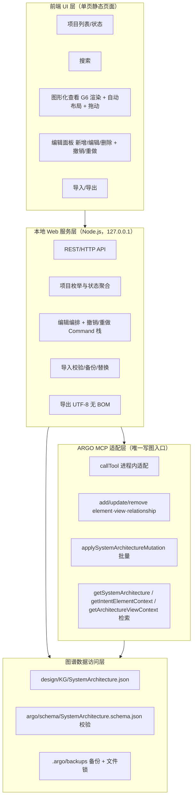

# ArchGraph 本地 Web 服务（EA 知识图谱导入/导出）— 方案设计

> 工作包：开发EA知识图谱导入导出本地Web服务（2758）
> 角色：系统设计师（caoyang，Business Actor 2739）
> 交付对象：规划专家 / 系统架构师（评审）→ 开发者（实现）
> 输入：`docs/ea-web-service-requirements.md`（S1–S11、US-1–11、FR-1–14、NF-1–11、AC-1–12）

## 1. 总体架构

系统采用**分层**结构，把「面向无 EA 经验用户的浏览器工具」与「与 Agent 一致的 ARGO MCP 写图路径」解耦：

- **前端 UI 层**：单页静态页面（HTML/CSS/JS，零构建、零 npm 依赖），由 Web 服务内置静态文件服务提供；图形内核采用成熟开源图库（首选 AntV G6 v5，备选 Cytoscape.js，均 MIT），以本地 vendored 静态资源加载（见 AD-c / AD-g）。
- **本地 Web 服务层**（HTTP 服务 + REST API）：项目枚举、状态、搜索、图形化数据、编辑、导入/导出编排。
- **ARGO MCP 适配层**：唯一写图入口，复用 `argo/scripts/argo-mcp-server.js` 导出的 `callTool`，把编辑操作映射为 ARGO MCP 写图接口；检索复用 `getSystemArchitecture`（语义）、`getIntentElementContext` / `getArchitectureViewContext`（上下文）。
- **图谱数据访问层**：按项目定位 `design/KG/SystemArchitecture.json`，负责校验（`argo/schema/SystemArchitecture.schema.json`）、备份与原子读取。



数据流：

1. **读**：前端 → `GET /api/projects`（枚举 + 状态）→ 选择项目 → `GET /api/projects/:id/views` / `GET /api/projects/:id/views/:vid/graph`（视图图数据）→ G6 渲染 + 自动布局。
2. **搜索**：前端 → `POST /api/projects/:id/search` → MCP 适配层 → `getSystemArchitecture(query)`（语义）或 `getIntentElementContext` / `getArchitectureViewContext`（上下文）→ 返回命中元素/关系/视图。
3. **写**：前端编辑 → `POST /api/projects/:id/edit` → 适配层映射 → ARGO MCP 写图接口（`addArchitectureElement` / `updateArchitectureElement` / `removeArchitectureElement` / `addArchitectureView` / `updateArchitectureView` / `removeArchitectureView` / `addArchitectureRelationship` / `updateArchitectureRelationship` / `removeArchitectureRelationship` / `applySystemArchitectureMutation`）→ 落盘 `SystemArchitecture.json`；编辑前自动备份、写后过 schema 校验，Command 栈记录逆操作供撤销/重做。
4. **导入/导出**：导出读文件以 UTF-8 无 BOM 返回；导入上传 JSON → 结构/引用校验 → 备份 → 原子写整体替换当前项目图谱（文档级批量操作，受控例外口径见 AD-a；元素级编辑仍经 ARGO MCP）。

## 2. 关键设计决策（§7 逐点 AD）

### AD-a：导入语义 —— 整体替换（含备份）

- **决策**：导入 = **整体替换**当前选中项目的 `design/KG/SystemArchitecture.json`（校验通过后，先备份，再以替换语义写入）。
- **理由**：需求（FR-14 / AC-11）语义是「导入外部图谱到当前项目」，图谱是单一 `System` 文档（schema 根字段 `name`/`description`/`elements`/`relationships`/`views`）；合并/追加需要 id 重映射、去重、悬空引用修复与视图合并等复杂且难以向无技术背景用户解释的语义，违背 NF-3（易用性）。整体替换 + 备份回滚最安全、最可预期。
- **被否方案**：合并/追加 —— 需要定义并实现 id 冲突、引用重映射、重复视图/元素去重等大量边角语义，复杂度高、易破坏图谱一致性。
- **写图口径（与 FR-13 的关系）**：`FR-13`「所有写入图谱必须经 ARGO MCP」适用于**元素/关系/视图级编辑**（add/update/remove/applySystemArchitectureMutation）。「整体替换导入」是**文档级批量操作**，ARGO MCP 目前没有整图替换工具，故作为**受控例外**：校验沿用与 ARGO MCP 相同的 schema（`argo/schema/SystemArchitecture.schema.json`），写入采用与 ARGO MCP 内部一致的「备份 + 原子写（temp+rename）+ 跨进程文件锁」原语；若后续 ARGO MCP 新增整图替换接口，再切回 MCP 路径。

### AD-b：技术栈与零配置启动 —— Node.js（内置 http + 静态文件服务）

- **决策**：**Node.js** 实现（`node:http` + 内置静态文件服务，无第三方运行时依赖），一条命令 `node scripts/ea-web-service.js` 或 `npm run ea-web-service`；Windows 提供双击 `start-ea-web-service.cmd`（内部调用 node）。
- **理由**：与仓库技术栈一致（`package.json` 声明 Node >=18、测试用 `node:test`），零外部依赖即满足 NF-1/NF-2；无需 npm install 构建链。
- **被否方案**：React/Vite 等前端框架（引入构建链与 npm install，违背零配置）；Python/其他运行时（引入非 Node 依赖与第二套工具链）。

### AD-c：网页 UI 与 HTTP 接口形态 —— 两者都要（内置单页 UI + REST JSON API）

- **决策**：**内置单页网页 UI**（继续零构建静态页面，HTML/CSS/JS）+ **REST/HTTP JSON API**（同一服务进程提供；前端即通过该 API 交互）；UI 的**图形内核采用成熟开源图库**——首选 **AntV G6 v5**（MIT），备选 **Cytoscape.js**（MIT），以本地 vendored 静态资源引入，不引入 React/Vite 构建链。
- **理由**：US-1/NF-3 要求无 EA 经验用户在浏览器完成操作，必须有 UI；REST API 同时供自动化脚本、集成测试与未来扩展复用，避免 UI 与后端逻辑耦合。图形渲染/布局/交互是图编辑器通用基础设施，G6/Cytoscape 十余年打磨、MIT 许可、社区活跃、中英双语文档，可零构建接入静态页面，不破坏 AD-b「零配置」。集成 UI（项目列表/搜索/编辑面板/导入导出）与 REST 编排是本服务的业务价值，值得自研；图形内核交给开源库更先进、更省成本。
- **被否方案**：
  1. 仅 HTTP 接口（不满足易用性目标）；静态页 + 独立 CLI 分离（割裂、无法零配置）。
  2. 继续「全自研 HTML/CSS/JS + SVG」图形内核——维护成本高、边界 case 多、无业务差异价值。
  3. 整页嵌入 draw.io/diagrams.net（iframe）——完整应用且图标/模板库有使用限制、难以编程绑定图谱数据模型与「编辑↔ARGO MCP」映射表。
  4. 整体迁移 React/Vite 前端框架——编辑体验上限最高，但引入构建链与 npm install，违背 AD-b「零配置」；列为**后续演进项**而非本阶段默认。
- **溯源**：本修订采纳规划专家洞察 `docs/ea-web-service-ui-insight.md`（Skill 元素 2766）第 0/2/3 节结论与 3.1 反馈。

### AD-d：多项目定义/枚举与路径映射、项目命名

- **决策**：项目根目录 = Web 服务启动时所在目录（可用 `--root` 显式指定）；**发现规则** = 自项目根递归（浅层、跳过 `node_modules`/`.git`）扫描包含 `design/KG/SystemArchitecture.json` 的目录，每个命中的目录的仓库根即为一个项目；**项目名** = 该仓库根目录 basename，重名时追加相对路径前缀消歧；可选 `projects.json` 显式配置覆盖（自定义名称/路径/排除）。
- **理由**：`design/KG/SystemArchitecture.json` 是 Argo 约定的图谱 marker（见 `argo/scripts/argo-paths.js`），零配置自动发现满足 S6/US-6；配置文件满足高级用户显式控制。
- **被否方案**：固定单项目（不满足 S6 多项目）；强制手动登记注册表（违背 NF-1 零配置）。

### AD-e：实时读取机制 —— fs.watch（防抖）+ 轮询兜底

- **决策**：**混合策略**：优先文件系统监听（`fs.watch` + 防抖），不可用或异常时回退/兜底为定时轮询（默认 5s，可配置）；状态读取只做浅层元数据（文件 mtime + 快速 JSON 解析出数量），避免每 tick 全量深解析。
- **理由**：watch 满足 NF-8 秒级实时且开销低；轮询兜底保证 Windows/网络盘/编辑器原子写（rename）等 watch 不可靠场景可用。
- **被否方案**：纯轮询（高频耗 CPU/IO，低频不满足秒级）；纯 watch（跨平台不可靠）。

### AD-f：Web 服务调用 ARGO MCP 写图方式 —— 进程内 import `callTool`（以 ARGO_REPO_ROOT 定位项目）

- **决策**：**进程内适配**：Web 服务 `require('argo/scripts/argo-mcp-server.js')`，调用其导出的 `callTool(name, args)`；对每个目标项目，先 `setMcpWorkspaceRoots`/设置 `ARGO_REPO_ROOT=<项目根>` 使 `getWorkspaceRoot()` 解析到该项目。语义检索复用 `systemarchitecture-mcp-server.js` 的 `createDefaultProductionSemanticOperatorJourney()` 作为 `callTool` 的 `dependencies`（与 JSON-RPC `tools/call` 处理器同一条路径）。保留 stdio 子进程 MCP 客户端作为可选后端（fallback）。
- **理由**：`argo/scripts/argo-mcp-server.js` 已导出 `callTool`（`module.exports = { callTool, handleRequest, ... }`），进程内调用与 Agent 写图共用**同一份代码**，天然满足 FR-13「与 Agent 写图保持一致」；零子进程开销、零 MCP 握手复杂度。`argo-paths.js` 中 `getWorkspaceRoot()` 优先读取 `ARGO_REPO_ROOT`，是解决多项目定位的正规入口。
- **被否方案**：直接读写 `SystemArchitecture.json`（违反 FR-13 红线，禁止）；仅 stdio 子进程 MCP 客户端（需自行实现 MCP 客户端握手与进程生命周期，延迟与复杂度高，但作为 fallback 保留）。

### AD-g：图形渲染与自动布局 —— AntV G6 v5（MIT，Canvas 默认可切 SVG/WebGL）

- **决策**：图形渲染与自动布局采用**成熟开源图库 AntV G6 v5（MIT）**：默认 **Canvas** 渲染（G6 支持 Canvas/SVG/WebGL 切换）；自动布局用其**内置力导向（force）+ 分层（dagre）+ 其它（radial/circular/grid）可切换**；节点**拖动/选择/命中**由库内置行为（`drag-node` / `drag-canvas` 等）提供；**固定节点位置由库原生支持**（拖动后节点位置即持久化，无需自研 `fx/fy` 固定逻辑）；缩略图（minimap）、tooltip 等交互组件随库插件获得。
- **理由**：渲染/布局/命中/拖动是通用基础设施，G6 单包即覆盖「力导向 + 分层 + 拖动 + 缩略图 + tooltip」，社区验证、中英双语文档；自研「SVG + 力导向 + 拖动命中」是图编辑器中最复杂、最易出 bug、且无业务价值的部分。原 AD-g 否决 Canvas 的理由（“命中/选择/拖动需自建坐标系统，可访问性差”）在引入成熟库后**不再成立**——G6/Cytoscape 已把命中、事件、可访问性处理完毕。备选 **Cytoscape.js（MIT）**（cose 力导向 + dagre/ELK 布局扩展）在 G6 不可用或不满足时兜底。
- **被否方案**：
  1. 继续自研「SVG + 力导向 + 拖动固定 `fx/fy`」——维护成本高，命中/可访问性仍需自建（已正式废止）；
  2. 自建 Canvas 坐标系统——命中/选择/拖动、可访问性均需自建；
  3. React Flow (xyflow) + ELK——节点编辑体验最佳，但需 React 构建链，违背 AD-b「零配置」，列为后续演进项。
- **溯源**：本修订采纳规划专家洞察 `docs/ea-web-service-ui-insight.md`（Skill 元素 2766）第 3.2/3.3 节反馈。

### AD-h：撤销/重做栈 —— Command 模式 + 内存栈（磁盘快照兜底）

- **决策**：**Command 模式**：每个编辑命令记录「正向 MCP 调用 + 逆操作（对应 MCP 逆调用）」，内存栈（深度上限默认 50）；配合**磁盘快照兜底**（进入编辑会话时落一份快照，进程崩溃后从快照恢复）。
- **理由**：Command 模式内存占用 O(命令数)、支持精确撤销/重做，且每条命令天然对应 ARGO MCP 写图调用（含参数），与 FR-13 一致；快照兜底保证崩溃可恢复（NF-11）。
- **被否方案**：纯全量快照（大图谱每步 O(N) 内存/磁盘，栈深度受限）；每步强制磁盘持久化（IO 开销大、延迟高）。

### AD-i：多项目编辑数据安全 —— 编辑前备份 + 串行队列 + 文件锁

- **决策**：编辑前**自动备份**当前 `SystemArchitecture.json` 到 `.argo/backups/<project>/<timestamp>.json`（保留最近 N 份，N 默认 10）；写图统一经 ARGO MCP 落盘；**并发控制** = 进程内每项目串行写队列 + 跨进程文件锁（锁文件 + 原子创建，占用失败则拒绝/排队），避免交叉覆盖。
- **理由**：备份可回滚（NF-6/NF-11），MCP 单点写入避免绕行，串行队列 + 文件锁消除并发交叉覆盖。
- **被否方案**：无备份直接写（违反 NF-11）；乐观并发/多版本合并（对单用户本地工具过重）。

## 3. API 设计（REST/HTTP 端点）

| 方法 | 路径 | 说明 |
| --- | --- | --- |
| GET | `/` | 内置单页 UI（静态 HTML/CSS/JS） |
| GET | `/api/projects` | 项目列表 + 各项目状态（name、path、valid、elements/relationships/views 数量、mtime） |
| POST | `/api/projects/select` | 选择当前操作项目（body: `{ project }`） |
| GET | `/api/projects/:id/status` | 单项目图谱状态 |
| POST | `/api/projects/:id/search` | 搜索（body: `{ mode: "semantic" \| "context", purpose, intent, elementId?, depth? }`） |
| GET | `/api/projects/:id/context/:elementId` | 上下文检索（getIntentElementContext 等价） |
| GET | `/api/projects/:id/views` | 视图列表 |
| GET | `/api/projects/:id/views/:viewId/graph` | 视图图形化数据（节点/边/布局坐标） |
| GET | `/api/projects/:id/export` | 导出当前项目图谱 JSON（UTF-8 无 BOM，`Content-Disposition` 下载） |
| POST | `/api/projects/:id/import` | 导入外部图谱 JSON（校验 → 备份 → 整体替换） |
| POST | `/api/projects/:id/edit` | 编辑操作（body: `{ op, ... }`，见映射表） |
| POST | `/api/projects/:id/undo` / `/redo` | 撤销 / 重做 |

### 编辑操作 ↔ ARGO MCP 写图接口一一映射表

| 编辑操作（前端语义） | HTTP 载荷 `op` | ARGO MCP 写图接口 |
| --- | --- | --- |
| 新增视图 | `addView` + `view` | `addArchitectureView` |
| 新增元素 | `addElement` + `element` + `view_ids` | `addArchitectureElement` |
| 编辑元素属性 | `updateElement` + `id` + `patch` | `updateArchitectureElement` |
| 删除元素 | `removeElement` + `id` + `view_ids?` | `removeArchitectureElement` |
| 编辑关系属性 | `updateRelationship` + `id` + `patch` | `updateArchitectureRelationship` |
| 删除关系 | `removeRelationship` + `id` + `view_ids?` | `removeArchitectureRelationship` |
| 批量/复合变更 | `applyMutation` + `mutations[]` | `applySystemArchitectureMutation` |

> 说明：`view_ids` 缺省表示全局删除/移除；`applySystemArchitectureMutation` 用于多步依赖变更的原子提交（与 Agent 一致）。`updateArchitectureView`（视图元数据/成员调整）在「编辑视图」操作中对应 `addArchitectureView`/`updateArchitectureView`/`removeArchitectureView` 三件套，映射表以「新增视图」为主列，删除视图走 `removeArchitectureView`。

## 4. 数据结构（前端图形化视图）

前端从 `GET /api/projects/:id/views/:viewId/graph` 获得以下形态，直接驱动 G6 渲染与布局：

```json
{
  "project": { "id": "<project>", "name": "<项目名>" },
  "view": { "view_id": "1800", "view_name": "EA Tooling" },
  "nodes": [
    {
      "id": "2760",
      "label": "ArchGraph 本地 Web 服务",
      "type": "Application Component",
      "layer": "Application",
      "x": 120.0, "y": 80.0,
      "fx": null, "fy": null,
      "data": { "description": "…", "parent": "1249" }
    }
  ],
  "edges": [
    {
      "id": "1985",
      "source": "2758", "target": "2760",
      "label": "Realization",
      "type": "Realization"
    }
  ]
}
```

- `nodes[].type` 直接映射到 ArchiMate 元素类型，`layer` 用于分层着色（由 schema `archimateElementType` 派生）。
- `x/y` 为自动布局后的坐标；`fx/fy` 非空表示用户手动拖动后的固定位置（由 G6 固定节点机制承接，布局不再移动该节点）。
- `edges` 的 `source/target` 指向 `nodes[].id`；布局算法在前端由 G6 执行（内置 force/dagre 等，默认前端运行，避免服务端重计算）。

## 4.1 技术栈 / 依赖（前端图形内核）

- **图内核**：AntV G6 v5（MIT，首选）/ Cytoscape.js（MIT，备选）。二者均**零构建接入静态页面**，与 AD-b「零配置」一致。
- **引入方式（本地 vendored，默认，符合零配置）**：将 G6 v5 的 ESM/UMD 产物拷贝到 Web 服务静态目录（如 `web/vendor/g6.min.js`），由内置静态文件服务以本地资源提供（127.0.0.1），前端用原生 `<script type="module">` 或 UMD 全局变量加载——**不引入 CDN**（避免外网依赖）、**不引入 npm install 构建链**。
- **备选（若接受 npm 依赖）**：`npm install @antv/g6` 后由本服务静态资源管线拷贝 dist 产物；仍由 Node http 服务本机提供，无外网依赖。
- **分层布局算法来源**：G6 内置 dagre 已够用；若对分层质量有更高要求，可另引入 elkjs（EPL-2.0）或 dagre（MIT）作为 G6 自定义布局扩展。
- **演进项（非本阶段默认）**：整体迁移 React/Vite 前端框架（如 React Flow + ELK）——编辑体验上限最高，但引入构建链与 npm install，违背 AD-b「零配置」，待后续按需评估。

## 5. 设计阶段验收标准（GIVEN-WHEN-THEN，可执行）

- **ADES-1（设计文档完整性）**：GIVEN 系统设计师已产出设计文档；WHEN 检查 `docs/ea-web-service-design.md`；THEN 文档包含总体架构分层、AD-a 至 AD-i 每个决策（决策+理由+被否方案）、API 端点清单、编辑操作↔ARGO MCP 写图接口映射表、前端图数据形态，且 AD-c/AD-g 采用开源图库内核（AntV G6 v5 / Cytoscape.js）而非全自研 SVG、并声明零构建接入。
- **ADES-2（写图一致性）**：GIVEN 设计文档已定义编辑操作集；WHEN 检查映射表；THEN 新增/编辑/删除视图/元素/关系分别映射到 `addArchitectureView` / `addArchitectureElement` / `updateArchitectureElement` / `removeArchitectureElement` / `updateArchitectureRelationship` / `removeArchitectureRelationship` / `applySystemArchitectureMutation`，禁止绕过 MCP 直接编辑 `SystemArchitecture.json`。
- **ADES-3（图谱建模）**：GIVEN 系统设计师已在意图图谱登记解决方案架构；WHEN 查询图谱；THEN 存在 Application Component「ArchGraph 本地 Web 服务」（parent=1249）、其导入/导出/搜索/图形化查看/编辑 Application Service 子元素，且 Work Package 2758 通过 Realization 关系实现该组件，全部元素/关系位于 EA Tooling 视图（1800）。
- **ADES-4（可执行性）**：GIVEN 设计文档与图谱元素均已就绪；WHEN 执行 `node --test tests/ea-web-service-design.test.js`；THEN 全部断言通过（文档关键内容 + 图谱元素/关系/testcases 为 GIVEN-WHEN-THEN）。
